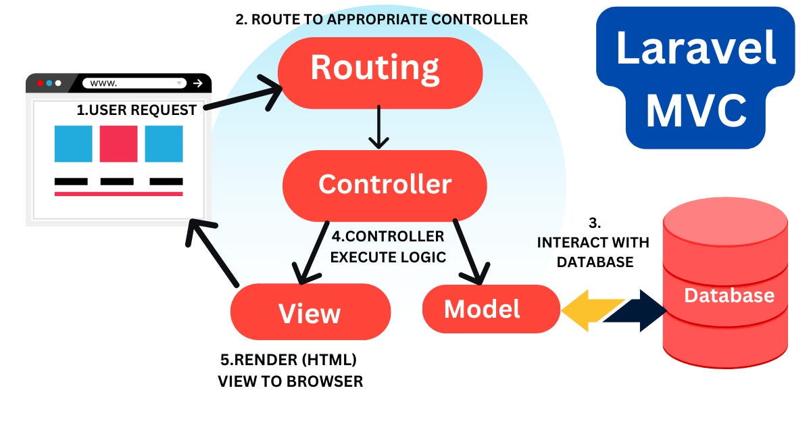

# The Ultimate Laravel Course in Bangla

### After completing this course, we'll build [10 Projects](#10-laravel-projects-for-beginners) in Laravel In-Sha-Allah.

After completing the 30-chapters module, jump in the [Projects Section](#10-laravel-projects-for-beginners).

|                                  **Chapter No.**                                   |                                                            **Topics**                                                            | **Video Explanation** |
| :--------------------------------------------------------------------------------: | :------------------------------------------------------------------------------------------------------------------------------: | :-------------------: |
|                    [00](#chapter-00-how-the-course-is-designed)                    |                               [How The Course is Designed](#chapter-00-how-the-course-is-designed)                               |       Watch Now       |
|                     [01](#chapter-01-introduction-to-laravel)                      |                                  [Introduction to Laravel](#chapter-01-introduction-to-laravel)                                  |       Watch Now       |
|              [02](#chapter-2-laravel-installation--environment-setup)              |                  [Laravel Installation & Environment Setup](#chapter-2-laravel-installation--environment-setup)                  |       Watch Now       |
|          [03](#chapter-3-laravel-folder-structure--mvc-pattern-explained)          |          [Laravel Folder Structure & MVC Pattern Explained](#chapter-3-laravel-folder-structure--mvc-pattern-explained)          |       Watch Now       |
|                    [04](#chapter-4-routing-in-laravel-web--api)                    |                              [Routing in Laravel Web & API](#chapter-4-routing-in-laravel-web--api)                              |       Watch Now       |
|      [05](#chapter-5-laravel-controllers--structure-usage-and-best-practices)      | [Laravel Controllers — Structure, Usage, and Best Practices](#chapter-5-laravel-controllers--structure-usage-and-best-practices) |     [Watch Now]()     |
|                [06](#chapter-6-blade-templating-engine-in-laravel)                 |                       [Blade Templating Engine in Laravel](#chapter-6-blade-templating-engine-in-laravel)                        |     [Watch Now]()     |
|              [07](#chapter-7-laravel-models--eloquent-orm-explained)               |                   [Laravel Models & Eloquent ORM Explained](#chapter-7-laravel-models--eloquent-orm-explained)                   |     [Watch Now]()     |
|              [08](#chapter-8-database-migration--seeding-in-laravel)               |                   [Database Migration & Seeding in Laravel](#chapter-8-database-migration--seeding-in-laravel)                   |     [Watch Now]()     |
|                      [09](#chapter-9-laravel-authentication)                       |                                   [Laravel Authentication](#chapter-9-laravel-authentication)                                    |     [Watch Now]()     |
|                          [10](#chapter-10-laravel-breeze)                          |                                           [Laravel Breeze](#chapter-10-laravel-breeze)                                           |     [Watch Now]()     |
|                            [11](#chapter-11-middleware)                            |                                               [Middleware](#chapter-11-middleware)                                               |     [Watch Now]()     |
|          [12](#chapter-12-laravel-role-based-authentication-with-breeze)           |            [Laravel Role Based Authentication with Breeze](#chapter-12-laravel-role-based-authentication-with-breeze)            |     [Watch Now]()     |
|                                       [13]()                                       |                                                               []()                                                               |     [Watch Now]()     |
|                                       [14]()                                       |                                    [](#chapter-14-php-array-functions-a-comprehensive-guide)                                     |     [Watch Now]()     |
|               [15](#chapter-15-php-global-variables---superglobals)                |                                       [](#chapter-15-php-global-variables---superglobals)                                        |     [Watch Now]()     |
|                  [16](#chapter-16-php-regular-expressions-regex)                   |                                          [](#chapter-16-php-regular-expressions-regex)                                           |     [Watch Now]()     |
|                        [17](#chapter-17-php-form-handling)                         |                                                [](#chapter-17-php-form-handling)                                                 |     [Watch Now]()     |
|                       [18](#chapter-18-php-form-validation)                        |                                               [](#chapter-18-php-form-validation)                                                |     [Watch Now]()     |
|               [19](#chapter-19-php-form-required-fields-validation)                |                                       [](#chapter-19-php-form-required-fields-validation)                                        |     [Watch Now]()     |
|               [20](#chapter-20-php-forms---validate-e-mail-and-url)                |                                       [](#chapter-20-php-forms---validate-e-mail-and-url)                                        |     [Watch Now]()     |
|                        [21](#chapter-21-php-date-and-time)                         |                                                [](#chapter-21-php-date-and-time)                                                 |     [Watch Now]()     |
|                      [22](#chapter-22-php-include-vs-require)                      |                                              [](#chapter-22-php-include-vs-require)                                              |     [Watch Now]()     |
|                        [23](#chapter-23-php-file-handling)                         |                                                [](#chapter-23-php-file-handling)                                                 |     [Watch Now]()     |
|                         [24](#chapter-24-php-file-upload)                          |                                                 [](#chapter-24-php-file-upload)                                                  |     [Watch Now]()     |
|                           [25](#chapter-25-php-cookies)                            |                                                   [](#chapter-25-php-cookies)                                                    |     [Watch Now]()     |
|                           [26](#chapter-26-php-sessions)                           |                                                   [](#chapter-26-php-sessions)                                                   |     [Watch Now]()     |
|                           [27](#chapter-27-php-filters)                            |                                                   [](#chapter-27-php-filters)                                                    |     [Watch Now]()     |
|                      [28](#chapter-28-php-callback-functions)                      |                                              [](#chapter-28-php-callback-functions)                                              |     [Watch Now]()     |
|                           [29](#chapter-29-php-and-json)                           |                                                   [](#chapter-29-php-and-json)                                                   |     [Watch Now]()     |
|                          [30](#chapter-30-php-exceptions)                          |                                                  [](#chapter-30-php-exceptions)                                                  |     [Watch Now]()     |
|               [31](#chapter-31-php-oop-object-oriented-programming)                |                                       [](#chapter-31-php-oop-object-oriented-programming)                                        |     [Watch Now]()     |
|                     [32](#chapter-32-php-oop-access-modifiers)                     |                                             [](#chapter-32-php-oop-access-modifiers)                                             |     [Watch Now]()     |
|                       [33](#chapter-33-php-oop-inheritance)                        |                                               [](#chapter-33-php-oop-inheritance)                                                |     [Watch Now]()     |
|                     [34](#chapter-34-php-oop-abstract-classes)                     |                                             [](#chapter-34-php-oop-abstract-classes)                                             |     [Watch Now]()     |
|        [35](#chapter-35-php-oop-interfaces-with-a-corporate-teamwork-story)        |                                [](#chapter-35-php-oop-interfaces-with-a-corporate-teamwork-story)                                |     [Watch Now]()     |
|        [36](#chapter-36-php-oop-traits-with-a-story-of-superskills-academy)        |                                                               []()                                                               |     [Watch Now]()     |
|                                       [37]()                                       |                                                               []()                                                               |     [Watch Now]()     |
|                                       [38]()                                       |                                                               []()                                                               |         []()          |
|                                        []()                                        |                                                               []()                                                               |     [Watch Now]()     |
| [40](#chapter-40-introduction-to-php-mysql-database-with-the-story-of-foodies-hub) |                                                               []()                                                               |     [Watch Now]()     |

# 10 Laravel Projects for Beginners

|                             **Project No.**                              |                                **Project Name**                                | **Video Explanation** |
| :----------------------------------------------------------------------: | :----------------------------------------------------------------------------: | :-------------------: |
|                                  [00]()                                  |                                      []()                                      |       Watch Now       |
|                 [01](#project-01-laravel-crud-operation)                 |          [Laravel CRUD Operation](#project-01-laravel-crud-operation)          |       Watch Now       |
|            [02](#project-02-student-teacher-role-based-auth)             | [Student Teacher Role Based Auth](#project-02-student-teacher-role-based-auth) |       Watch Now       |
|     [03](#chapter-3-laravel-folder-structure--mvc-pattern-explained)     |         [](#chapter-3-laravel-folder-structure--mvc-pattern-explained)         |       Watch Now       |
|               [04](#chapter-4-routing-in-laravel-web--api)               |                   [](#chapter-4-routing-in-laravel-web--api)                   |       Watch Now       |
| [05](#chapter-5-laravel-controllers--structure-usage-and-best-practices) |     [](#chapter-5-laravel-controllers--structure-usage-and-best-practices)     |     [Watch Now]()     |
|           [06](#chapter-6-blade-templating-engine-in-laravel)            |               [](#chapter-6-blade-templating-engine-in-laravel)                |     [Watch Now]()     |
|         [07](#chapter-7-laravel-models--eloquent-orm-explained)          |             [](#chapter-7-laravel-models--eloquent-orm-explained)              |     [Watch Now]()     |
|         [08](#chapter-8-database-migration--seeding-in-laravel)          |             [](#chapter-8-database-migration--seeding-in-laravel)              |     [Watch Now]()     |
|                 [09](#chapter-9-laravel-authentication)                  |                     [](#chapter-9-laravel-authentication)                      |     [Watch Now]()     |
|                     [10](#chapter-10-laravel-breeze)                     |                         [](#chapter-10-laravel-breeze)                         |     [Watch Now]()     |

# Chapter-00: How The Course is Designed

- [কোর্সটি কাদের জন্য?](#কোর্সটি-কাদের-জন্য)
- [Prerequisite](#prerequisite)
- [কোর্সটি যেভাবে সাজানো হয়েছে](#কোর্সটি-যেভাবে-সাজানো-হয়েছেঃ)

### কোর্সটি কাদের জন্য?

- এই কোর্সটিতে যেকেউ অংশগ্রহণ করতে পারবে। শিখার জন্য মনের ইচ্ছাটাই আসল!
- Course টি মূলত Beginner-friendly. যারা Web Programming এ নতুন তাদেরকে উদ্দেশ্য করেই Course টি সাজানো।

### Prerequisite

- HTML, CSS, JavaScript, PHP, MySQL

### কোর্সটি যেভাবে সাজানো হয়েছেঃ

- এই পুরো Article কে একটা বই মনে করতে পারো। কোর্সটি 30 টি Chapter এ ভাগ করা হয়েছে। প্রতিটি Chapter এ MySQL এর বিভিন্ন Topics নিয়ে আলোচনা করা হয়েছে।
- প্রতিটা Chapter এর Module সাজানো হয়েছে ক্রমানুসারে । উদাহরণস্বরূপ, Chapter-05 এর টপিকসগুলো শিখতে হলে অবশ্যই আপনাকে Chapter-04 শেষ করে আসতে হবে। একইভাবে Chapter-04 শিখতে হলে আপনাকে Chapter-03 শেষ করে আসতে হবে ।
- প্রতিটা Chapter এর Topics এর Written Explanation/Article এর সাথে সাথে Video Explanation-ও দেয়া আছে। যাতে শিক্ষার্থীরা খুব সহজেই টপিকসগুলো আত্মস্থ করতে পারে।

# Chapter-01: Introduction to Laravel

## 📚 Table of Contents

1. [What is Laravel?](#what-is-laravel)
2. [Why Use Laravel?](#why-use-laravel)
3. [Laravel as a Modern PHP Framework](#laravel-as-a-modern-php-framework)
4. [Laravel’s MVC Architecture](#laravels-mvc-architecture)
5. [Key Features of Laravel](#key-features-of-laravel)
6. [Real-Life Examples](#real-life-examples)
7. [Next Chapter Preview](#next-chapter-preview)

---

## 1️⃣ What is Laravel?

- Laravel একটি **Web Application Framework**, যা ব্যবহার করে খুব সহজে এবং সুসংগঠিতভাবে Web Application তৈরি করা যায়। যখন একটি Web Application তৈরি করা হয়, তখন সাধারণত অনেক ধরনের কাজ করতে হয় যেমন Routing তৈরি করা, Database এর সাথে সংযোগ করা, User Authentication করা, Security নিশ্চিত করা, File Structure ঠিক রাখা ইত্যাদি। যদি Framework ব্যবহার না করা হয়, তাহলে একজন Developer-কে এই সবকিছু শুরু থেকে নিজে তৈরি করতে হয়। এতে অনেক সময় নষ্ট হয় এবং ভুল হওয়ার সম্ভাবনাও বেশি থাকে। Laravel এই সমস্যাগুলো সমাধান করে একটি প্রস্তুত এবং সুসংগঠিত কাঠামো প্রদান করে।

## 2️⃣ Why Use Laravel?

1. Laravel-এর Syntax খুবই **Expressive এবং Elegant**। Expressive বলতে বোঝায় এমন Code Style যেখানে Code পড়লেই সহজে বোঝা যায় সেটি কী কাজ করছে। Elegant বলতে বোঝায় Code লেখার পদ্ধতি পরিষ্কার, সুন্দর এবং গুছানো। এর ফলে একজন Developer যখন Code লিখে বা অন্য কারও লেখা Code পড়ে, তখন সহজেই বুঝতে পারে Program কীভাবে কাজ করছে। এটি বড় Project-এ খুবই গুরুত্বপূর্ণ, কারণ অনেক Developer মিলে একই Project-এ কাজ করে।

2. Laravel একটি Application তৈরি করার জন্য একটি নির্দিষ্ট **Structure বা Architecture** প্রদান করে। এর ফলে Project-এর সব File এবং Code একটি নির্দিষ্ট নিয়ম মেনে সাজানো থাকে। এই Structure অনুসরণ করলে Project maintain করা সহজ হয় এবং নতুন Developer যদি Project-এ যোগ দেয়, তাহলে সে দ্রুত বুঝতে পারে কোন Code কোথায় রয়েছে। এই ধরনের গঠনতন্ত্র Developer-কে Technical জটিলতা নিয়ে চিন্তা না করে Application-এর মূল Feature তৈরির দিকে মনোযোগ দিতে সাহায্য করে।

3. Laravel-এর অন্যতম শক্তিশালী Feature হলো **Dependency Injection**। একটি বড় Application সাধারণত অনেক Class এবং Object দিয়ে তৈরি হয়। অনেক সময় একটি Class অন্য Class-এর উপর নির্ভরশীল হয়। Dependency Injection এমন একটি পদ্ধতি যেখানে এই নির্ভরশীল Object গুলোকে সহজভাবে Manage করা যায়। এর ফলে Code আরও Modular হয় এবং Application-এর বিভিন্ন অংশ আলাদা আলাদা ভাবে কাজ করতে পারে। এতে Code পরিবর্তন করা বা Test করা অনেক সহজ হয়।

4. Laravel একটি শক্তিশালী **Database Abstraction Layer** প্রদান করে। Database-এর সাথে কাজ করার সময় সাধারণত SQL Query লিখতে হয়। Laravel এই কাজকে সহজ করার জন্য Query Builder এবং ORM (Object Relational Mapping) ব্যবহার করে। এর ফলে Database-এর Table গুলোকে Object হিসেবে ব্যবহার করা যায় এবং Database Query অনেক সহজ ও পরিষ্কারভাবে লেখা যায়। Developer খুব কম Code লিখে Database থেকে Data Insert, Update, Delete এবং Retrieve করতে পারে।

5. Laravel-এর আরেকটি গুরুত্বপূর্ণ Feature হলো **Queue System**। Web Application-এ অনেক সময় এমন কিছু কাজ থাকে যেগুলো সম্পন্ন হতে অনেক সময় লাগে। উদাহরণ হিসেবে Email পাঠানো, বড় File Process করা বা Data Analysis করা। যদি এই কাজগুলো সরাসরি Request এর সময় করা হয়, তাহলে Website ধীর হয়ে যেতে পারে। Queue ব্যবহার করলে এই কাজগুলো Background-এ চলে যায় এবং User দ্রুত Response পায়।

6. Laravel **Scheduled Jobs** Support করে। এর মাধ্যমে নির্দিষ্ট সময়ে Automatic কাজ চালানো যায়। যেমন প্রতিদিন Database Backup নেওয়া, নির্দিষ্ট সময়ে Report তৈরি করা বা কিছু Data Clean করা। Developer একটি নির্দিষ্ট সময় নির্ধারণ করে দিলে Laravel নিজে থেকেই সেই কাজ নির্দিষ্ট সময়ে চালায়।

7. Laravel-এর মধ্যে **Testing System** রয়েছে যা Software Development-এ খুব গুরুত্বপূর্ণ। Testing এর মাধ্যমে Application-এর বিভিন্ন অংশ সঠিকভাবে কাজ করছে কিনা তা যাচাই করা যায়। Unit Testing একটি ছোট অংশ বা Function পরীক্ষা করে, আর Integration Testing Application-এর বিভিন্ন অংশ একসাথে কাজ করছে কিনা তা পরীক্ষা করে। এর ফলে Application-এর Quality অনেক উন্নত হয় এবং বড় সমস্যা হওয়ার আগেই Bug ধরা পড়ে।

8. Web Application তৈরি করার জন্য বর্তমানে অনেক ধরনের **Tools এবং Framework** রয়েছে। যেমন বিভিন্ন Programming Language এবং Framework ব্যবহার করে Web Application তৈরি করা যায়। তবে Laravel এমন একটি Framework যা আধুনিক **Full-Stack Web Application** তৈরি করার জন্য বিশেষভাবে উপযোগী। Full-Stack Web Application বলতে এমন Application বোঝায় যেখানে Frontend এবং Backend উভয় দিকের কাজ একসাথে সুন্দরভাবে পরিচালনা করা যায়। Laravel এমন একটি পরিবেশ তৈরি করে যেখানে Developer খুব দ্রুত, নিরাপদ এবং সুসংগঠিতভাবে একটি সম্পূর্ণ Web Application তৈরি করতে পারে।

9. Laravel-কে একটি **Progressive Framework** বলা হয়। Progressive Framework বলতে বোঝায় এমন একটি Framework যা Developer-এর দক্ষতার সাথে সাথে ব্যবহার করা যায় এবং Developer যত শিখবে, Framework তত বেশি শক্তিশালীভাবে ব্যবহার করতে পারবে। কেউ যদি Web Development-এ নতুন হয়, তাহলে Laravel শেখা শুরু করার জন্য প্রচুর Documentation, Guide এবং Video Tutorial রয়েছে। এগুলো অনুসরণ করলে ধাপে ধাপে Laravel শেখা যায় এবং নতুন Developer খুব বেশি জটিলতার মধ্যে পড়ে না।

10. যারা অনেক অভিজ্ঞ Developer, তাদের জন্য Laravel আরও শক্তিশালী Tools প্রদান করে। যেমন **Dependency Injection**, **Unit Testing**, **Queues**, এবং **Real-Time Events**। Dependency Injection ব্যবহার করে Application-এর বিভিন্ন অংশের মধ্যে নির্ভরশীলতা খুব সুন্দরভাবে পরিচালনা করা যায়। Unit Testing ব্যবহার করে Application-এর প্রতিটি অংশ ঠিকভাবে কাজ করছে কিনা তা পরীক্ষা করা যায়। Queue System ব্যবহার করে এমন কাজগুলো Background-এ করা যায় যেগুলো সম্পন্ন হতে বেশি সময় লাগে। Real-Time Event ব্যবহার করে Application-এ তাৎক্ষণিক Data Update বা Notification পাঠানো সম্ভব হয়। এই সব Feature Laravel-কে একটি Professional মানের Web Application তৈরি করার জন্য অত্যন্ত শক্তিশালী Framework বানিয়েছে। বড় বড় Enterprise Level Application-ও Laravel দিয়ে তৈরি করা সম্ভব।

11. Laravel একটি **Scalable Framework**। Scalable বলতে বোঝায় Application-এর ব্যবহারকারী সংখ্যা বা Request সংখ্যা বাড়লেও Application যেন সহজে সেই চাপ সামলাতে পারে। PHP নিজেই এমন একটি Language যা Server-এ খুব সহজে Scale করা যায়। Laravel এই সুবিধাকে আরও উন্নত করেছে। Laravel-এর মধ্যে **Distributed Cache System** ব্যবহার করার সুবিধা রয়েছে, যেমন Redis। Cache ব্যবহার করলে Database-এ বারবার Query করার পরিবর্তে Data দ্রুত পাওয়া যায়। এর ফলে Application অনেক দ্রুত কাজ করে এবং Server-এর উপর চাপ কমে যায়।

12. Laravel Application খুব সহজে **Horizontal Scaling** করতে পারে। Horizontal Scaling বলতে বোঝায় একটি Server-এর পরিবর্তে একাধিক Server ব্যবহার করে Application চালানো। যখন Application-এ প্রচুর User আসে, তখন Load বিভিন্ন Server-এ ভাগ করে দেওয়া যায়। এর ফলে Application ধীর হয়ে যায় না এবং বড় পরিমাণ Traffic সহজে সামলাতে পারে। Laravel ব্যবহার করে এমন অনেক Application তৈরি হয়েছে যেগুলো প্রতি মাসে শত শত মিলিয়ন Request সফলভাবে পরিচালনা করে।

13. যদি Application-কে আরও বড় Scale-এ নিয়ে যেতে হয়, তাহলে **Laravel Cloud** এর মতো Platform ব্যবহার করা যায়। এই ধরনের Platform ব্যবহার করে Laravel Application প্রায় সীমাহীন পরিমাণ User এবং Traffic সামলাতে সক্ষম হয়।

14. Laravel একটি **Agent Ready Framework**, যার অর্থ এটি AI Assisted Development-এর জন্যও খুব উপযোগী। বর্তমানে অনেক Developer AI Tool ব্যবহার করে Code লিখতে সাহায্য নেয়। যেমন Cursor বা Claude Code-এর মতো Tool ব্যবহার করলে AI Developer-এর নির্দেশ অনুযায়ী Code তৈরি করতে পারে। Laravel-এর একটি নির্দিষ্ট Structure এবং Convention রয়েছে, যার কারণে AI খুব সহজে বুঝতে পারে কোন File কোথায় তৈরি করতে হবে।

15. উদাহরণ হিসেবে যদি একটি **Controller** তৈরি করতে বলা হয়, Laravel-এর Project Structure এতটাই পরিষ্কার যে AI সহজেই বুঝতে পারে Controller File কোথায় রাখা হবে। একইভাবে যখন একটি **Migration** তৈরি করা হয়, তখন File-এর নাম এবং Location একটি নির্দিষ্ট নিয়ম মেনে তৈরি হয়। এই ধারাবাহিকতা AI Tool-কে Code তৈরি করার সময় বিভ্রান্ত হতে দেয় না।

16. Laravel-এর Syntax খুব পরিষ্কার এবং সুসংগঠিত। এর সাথে Laravel-এর Documentation খুব সমৃদ্ধ। এই কারণে AI Tool গুলো সহজেই Laravel-এর Code Pattern বুঝতে পারে। Laravel-এর **Eloquent Relationships**, **Form Requests**, এবং **Middleware** নির্দিষ্ট Pattern অনুসরণ করে তৈরি করা হয়। AI এই Pattern গুলো বুঝতে পারে এবং সেই অনুযায়ী Code তৈরি করতে পারে। ফলে AI দ্বারা তৈরি করা Code এমন দেখায় যেন একজন অভিজ্ঞ Laravel Developer এটি লিখেছে।

17. Laravel একটি শক্তিশালী **Community Framework**। Laravel একা কোনো একজন Developer-এর কাজ নয়। বিশ্বের হাজার হাজার Developer Laravel উন্নত করার জন্য অবদান রেখেছে। PHP Ecosystem-এ যে সব ভালো Package রয়েছে, Laravel সেগুলোর সেরা অংশগুলো ব্যবহার করে একটি শক্তিশালী Framework তৈরি করেছে। এর ফলে Laravel ব্যবহার করলে Developer অনেক শক্তিশালী Tool এবং Library সহজেই ব্যবহার করতে পারে।

18. Laravel Community খুব বড় এবং সক্রিয়। বিভিন্ন Developer নতুন Feature তৈরি করে, Bug Fix করে এবং নতুন Package তৈরি করে Laravel-কে আরও উন্নত করছে। এই Community Support থাকার কারণে Laravel ব্যবহার করলে সমস্যা হলে দ্রুত সমাধান পাওয়া যায় এবং নতুন নতুন প্রযুক্তি সহজে শেখা যায়।

## 3️⃣ Laravel as a Modern PHP Framework

Laravel modern PHP framework হওয়ায় এটি PHP 7/8 এর অনেক advanced feature যেমন:

- Dependency Injection
- Traits
- Namespaces
- Closures

ব্যবহার করতে পারে। Laravel PHP developer দের জন্য এমন একটি ecosystem তৈরি করেছে যেখানে:

- Package management (Composer)
- Modern tooling (Laravel Mix)
- RESTful API support
- Queue Management
- Event Broadcasting

সবকিছু এক প্ল্যাটফর্মেই manage করা যায়।

---

## 4️⃣ Laravel’s MVC Architecture

Laravel পুরোপুরি **MVC Pattern** ফলো করে। এতে করে application এর structure পরিষ্কার ও separated থাকে।

### 🔍 MVC Breakdown:

| Component      | Responsibility                                                        |
| -------------- | --------------------------------------------------------------------- |
| **Model**      | Database এর সাথে যোগাযোগ ও ডেটার ব্যাবস্থাপনা                         |
| **View**       | User Interface বা HTML present করে                                    |
| **Controller** | Request handle করে, logic পরিচালনা করে এবং Model/View এর সাথে কাজ করে |

এই architecture ব্যবহারের ফলে:

- Code Maintainability বাড়ে
- Testing সহজ হয়
- Team-based development সহজ হয়

---

## 5️⃣ Key Features of Laravel

### 1. **Routing System**

Laravel এর routing system অনেক expressive:

```php
Route::get('/about', [PageController::class, 'about']);
```

### 2. **Blade Templating Engine**

Laravel এর নিজস্ব templating engine "Blade" যা PHP code কে খুব clean করে তোলে:

```blade
<h1>Hello, {{ $name }}</h1>
```

### 3. **Eloquent ORM**

Eloquent দিয়ে database এ query execute করা অনেক readable এবং intuitive:

```php
$users = User::where('active', 1)->get();
```

### 4. **Authentication & Authorization**

Laravel Breeze, Jetstream, Fortify এর মাধ্যমে authentication system খুব দ্রুত implement করা যায়।

### 5. **Artisan Command Line Tool**

নিচের মতো command দিয়েই অনেক কাজ করা যায়:

```bash
php artisan make:controller UserController
php artisan migrate
php artisan route:list
```

### 6. **Queue System**

Background Job handle করার জন্য Laravel এ built-in queue management রয়েছে।

### 7. **Middleware**

Request গুলোকে filter বা modify করার জন্য Laravel এ middleware ব্যবহার করা হয়:

```php
Route::group(['middleware' => ['auth']], function () {
    // protected routes
});
```

---

## 6️⃣ Real-Life Examples

### 🔵 Example 1: E-Commerce Platform

Laravel দিয়ে একটি সম্পূর্ণ E-commerce Application তৈরি করা যায় যেখানে থাকবে:

- Product Management
- User Dashboard
- Order Tracking
- Payment Gateway Integration

### 🔵 Example 2: SaaS Dashboard System

Multi-tenant SaaS application তৈরি করা Laravel এর সাথে খুবই সুবিধাজনক:

- Subscription Management
- Tenant Isolation
- Team Management
- Invoice & Billing

---

## 7️⃣ Next Chapter Preview

📘 **Chapter 2: Laravel Installation & Environment Setup**

এই Chapter এ আপনি শিখবেন:

- কিভাবে Laravel আপনার মেশিনে install করবেন
- Laravel project create করবেন
- Laravel development environment setup করবেন (XAMPP, Valet, Sail)
- Project run করবেন এবং first request handle করবেন

<div align="right">
    <b><a href="#the-ultimate-laravel-course-in-bangla">⬆️ Go to Top</a></b>
</div>

# Chapter 2: Laravel Installation & Environment Setup

## 📚 Table of Contents

1. [System Requirements](#system-requirements)
2. [Installing Laravel Globally (via Composer)](#installing-laravel-globally-via-composer)
3. [Creating a New Laravel Project](#creating-a-new-laravel-project)
4. [Serving the Project Locally](#serving-the-project-locally)
5. [Directory Structure Overview (High-Level)](#directory-structure-overview-high-level)
6. [Environment Configuration (.env)](#environment-configuration-env)
7. [Alternatives: Laravel Sail (Optional)](#alternatives-laravel-sail-optional)
8. [Next Chapter Preview](#next-chapter-preview)

---

## 1️⃣ System Requirements

Laravel 10 বা তার পরের ভার্সন ব্যবহার করতে চাইলে আপনার মেশিনে নিচের সফটওয়্যার গুলো থাকা দরকার:

| Software                   | Required Version               |
| -------------------------- | ------------------------------ |
| **PHP**                    | 8.1 বা তার বেশি                |
| **Composer**               | Latest                         |
| **MySQL**                  | 5.7 বা তার বেশি                |
| **Node.js & NPM**          | (Optional) for frontend assets |
| **XAMPP / HERD / Laragon** | Local server                   |

> 💡 Laravel এর জন্য `Composer` অবশ্যই লাগবে, কারণ Laravel projects এর dependency গুলো composer এর মাধ্যমে manage হয়।

---

## 2️⃣ Installing Laravel Globally (via Composer)

Laravel installer কে globally install করতে চাইলে নিচের command ব্যবহার করুন:

```bash
composer global require laravel/installer
```

> 🔸 এর ফলে আপনি `laravel` নামে একটি global command পাবেন যা দিয়ে খুব সহজে নতুন Laravel project তৈরি করা যায়।

✅ Installation শেষে নিশ্চিত করুন composer এর global vendor/bin path আপনার PATH এ যোগ করা হয়েছে:

**Windows:**

```bash
C:\Users\YourName\AppData\Roaming\Composer\vendor\bin
```

**macOS/Linux:**

```bash
export PATH="$PATH:$HOME/.composer/vendor/bin"
```

---

## 3️⃣ Creating a New Laravel Project

Laravel installer install করার পর আপনি নিচের command দিয়ে একটি নতুন Laravel project তৈরি করতে পারেন:

```bash
laravel new blog
```

এতে করে `blog` নামের একটি নতুন Laravel অ্যাপ তৈরি হবে।

**Alternatively**, আপনি Composer দিয়েও Laravel install করতে পারেন:

```bash
composer create-project laravel/laravel blog
```

---

## 4️⃣ Serving the Project Locally

Laravel এ built-in development server রয়েছে। এর মাধ্যমে আপনি খুব সহজে আপনার অ্যাপ run করতে পারেন:

```bash
cd blog
php artisan serve
```

এই কমান্ড run করলে Laravel এই URL এ চালু হবে:

```
http://localhost:8000
```

আপনি ব্রাউজারে এই URL visit করলে Laravel এর default welcome page দেখতে পাবেন ✅

---

## 5️⃣ Directory Structure Overview (High-Level)

Laravel install করার পর আপনি এইরকম ফোল্ডার গুলো দেখতে পাবেন:

| Folder         | Description                                      |
| -------------- | ------------------------------------------------ |
| **app/**       | Core application logic (Model, Services, etc.)   |
| **routes/**    | All route files live here (`web.php`, `api.php`) |
| **resources/** | Blade views, assets (CSS, JS), etc.              |
| **public/**    | Entry point of the app (`index.php`)             |
| **database/**  | Migrations, seeders, factories                   |
| **config/**    | All config files                                 |
| **.env**       | Environment-specific configuration               |
| **artisan**    | Laravel CLI command file                         |

---

## 6️⃣ Environment Configuration (.env)

Laravel এর `.env` ফাইলটি হচ্ছে আপনার অ্যাপের sensitive configuration variables রাখার জায়গা।

```dotenv
APP_NAME=Laravel
APP_ENV=local
APP_KEY=base64:xxxx
APP_URL=http://localhost

DB_CONNECTION=mysql
DB_HOST=127.0.0.1
DB_PORT=3306
DB_DATABASE=laravel_db
DB_USERNAME=root
DB_PASSWORD=
```

> এই ফাইলের মাধ্যমে আপনি **ডাটাবেজ, অ্যাপ URL, কনফিগারেশন কাস্টমাইজ** করতে পারেন environment অনুযায়ী।

---

## 7️⃣ Alternatives: Laravel Sail (Optional)

যারা Docker ব্যবহার করেন তাদের জন্য Laravel Sail একটি lightweight Docker-based environment।

Install করার জন্য:

```bash
curl -s https://laravel.build/example-app | bash
cd example-app
./vendor/bin/sail up
```

> Sail ব্যাবহার করলে আলাদাভাবে PHP, MySQL, Redis ইত্যাদি install করতে হয় না। সবকিছু container এর মধ্যে চলে।

---

## ⏭️ Next Chapter Preview

📘 **Chapter 3: Laravel Folder Structure & MVC Pattern Explained**

এই অধ্যায়ে আমরা আলোচনা করবো:

- Laravel এর প্রতিটি ফোল্ডার কী কাজ করে
- MVC pattern Laravel এ কিভাবে implement করা হয়েছে
- কীভাবে Controller, Model, View একসাথে কাজ করে

<div align="right">
    <b><a href="#the-ultimate-laravel-course-in-bangla">⬆️ Go to Top</a></b>
</div>

# Chapter 3: Laravel Folder Structure & MVC Pattern Explained

## 📚 Table of Contents

1. [Overview of Laravel Folder Structure](#overview-of-laravel-folder-structure)
2. [Detailed Explanation of Each Folder](#detailed-explanation-of-each-folder)
3. [What is MVC Pattern?](#what-is-mvc-pattern)
4. [How MVC Works in Laravel (Flow Explanation)](#how-mvc-works-in-laravel-flow-explanation)
5. [Step-by-Step MVC Example with Code and Explanation](#step-by-step-mvc-example-with-code-and-explanation)
6. [Next Chapter Preview](#next-chapter-preview)

---

## 1️⃣ Overview of Laravel Folder Structure

Laravel install করার পর আপনি এইরকম কিছু core directories পাবেন:

```
project-name/
│
├── app/
├── bootstrap/
├── config/
├── database/
├── public/
├── resources/
├── routes/
├── storage/
├── tests/
├── vendor/
└── .env
```

এই গঠনটা আপনাকে সাহায্য করে একটি বড় Application কে সংগঠিত ও maintainable রাখতে।

---

## 2️⃣ Detailed Explanation of Each Folder

### 🔹 `app/`

Laravel এর business logic বা core functionality এখানে থাকে। এর মধ্যে সাধারণত নিচের directories থাকে:

- `Models/` – Eloquent Models
- `Http/Controllers/` – Controller classes
- `Http/Middleware/` – Middleware logic
- `Providers/` – Service providers (bootstrapping logic)

> এটি হলো Application এর মূল Engine যেখানে data, logic ও control structure থাকে।

---

### 🔹 `routes/`

এই ফোল্ডারে Laravel এর Route ফাইল গুলো থাকে:

- `web.php` → Web routes (browser-based interaction)
- `api.php` → API routes (JSON responses)
- `console.php` → Artisan commands এর routes
- `channels.php` → Broadcasting routes

> Routing হচ্ছে Laravel এর সবচেয়ে গুরুত্বপূর্ণ অংশ যেখানে Request কোন Controller যাবে তা নির্ধারণ হয়।

---

### 🔹 `resources/`

User Interface সম্পর্কিত সব কিছু এখানে থাকে:

- `views/` → Blade templates
- `css/`, `js/` → Static assets (Laravel Mix এর জন্য)
- `lang/` → Localization files

---

### 🔹 `public/`

এখানে থাকে publicly accessible ফাইল যেমন:

- `index.php` → Laravel এর entry-point (Request এই ফাইল দিয়ে শুরু হয়)
- CSS, JS, Images

> এই ফোল্ডারটি ওয়েব সার্ভারের root হিসেবে কাজ করে।

---

### 🔹 `config/`

সকল configuration ফাইল এখানে থাকে (যেমন `app.php`, `database.php`, `mail.php`) যা `.env` ফাইলের সাথে মিলে কাজ করে।

---

### 🔹 `database/`

Laravel এর Database সম্পর্কিত সকল কিছু এখানে থাকে:

- `migrations/` → Database schema definition
- `seeders/` → Demo/test data insert করার class
- `factories/` → Fake data generate করার জন্য

---

### 🔹 `storage/`

File uploads, cache, compiled views, logs — সব কিছু এখানে রাখা হয়।

---

### 🔹 `.env`

Environment-specific config যেমন database credentials, app name, URL ইত্যাদি এখানে define করা হয়।

```env
APP_NAME=LaravelApp
DB_HOST=127.0.0.1
DB_DATABASE=laravel
DB_USERNAME=root
DB_PASSWORD=
```

> `.env` ফাইল পরিবর্তন করলে আপনাকে cache clear করতে হতে পারে:

```bash
php artisan config:clear
```

---

## 3️⃣ What is MVC Pattern?

**MVC** এর পূর্ণরূপ হলো:  
🔹 **Model - View - Controller**

Laravel এই তিনটি Layer ব্যবহার করে Application Structure তৈরি করে। এতে করে Code Management clean ও Maintainable থাকে।

| Layer          | Description (Bangla & English)                                                             |
| -------------- | ------------------------------------------------------------------------------------------ |
| **Model**      | Database এর সাথে কাজ করে। Data create, update, delete, retrieve সব কাজ Model করে।          |
| **View**       | User Interface – যেটা User দেখতে পায়। HTML, Blade File, CSS ইত্যাদি এখানে থাকে।            |
| **Controller** | Model আর View এর মাঝে Mediator এর কাজ করে। User এর request নেয়, Process করে, Response দেয়। |



## 4️⃣ How MVC Works in Laravel (Flow Explanation)

1. ব্রাউজার থেকে User একটি URL হিট করে →
2. Laravel `routes/web.php` থেকে নির্ধারণ করে কোন Controller কে কল করতে হবে
3. Controller Model কে ব্যবহার করে database থেকে ডেটা আনে
4. Controller সেই ডেটা View এ পাঠায়
5. View সেই ডেটা HTML আকারে ইউজারকে দেখায়

এভাবেই পুরো Request lifecycle চলে।

---

## 5️⃣ Step-by-Step MVC Example with Code and Explanation

আমরা একটি ছোট Task Management System বানাবো।

---

### 📝 Step 1: Create a Model & Migration

```bash
php artisan make:model Task -m
```

এতে `app/Models/Task.php` এবং `database/migrations/xxxx_create_tasks_table.php` তৈরি হবে।

#### `app/Models/Task.php`

```php
namespace App\Models;

use Illuminate\Database\Eloquent\Model;

class Task extends Model
{
    protected $fillable = ['title', 'description'];
}
```

**Explanation:**

- `fillable` array বলে দেয় কোন fields গুলো mass-assignment করা যাবে (form থেকে insert করার সময়)
- এই Model দিয়ে আমরা `tasks` টেবিল এর সাথে কাজ করবো

---

### 🗃️ Step 2: Edit Migration and Migrate

#### `database/migrations/xxxx_create_tasks_table.php`

```php
Schema::create('tasks', function (Blueprint $table) {
    $table->id();
    $table->string('title');
    $table->text('description')->nullable();
    $table->timestamps();
});
```

```bash
php artisan migrate
```

**Explanation:**

- `title` ফিল্ড হবে string
- `description` হবে optional text
- `timestamps()` add করবে `created_at` ও `updated_at`

---

### 🎮 Step 3: Create Controller

```bash
php artisan make:controller TaskController
```

#### `app/Http/Controllers/TaskController.php`

```php
use App\Models\Task;

public function index() {
    $tasks = Task::all();
    return view('tasks.index', compact('tasks'));
}
```

**Explanation:**

- `Task::all()` → DB থেকে সব task আনে
- `compact('tasks')` → variable `tasks` কে View এ পাঠায়

---

### 🔗 Step 4: Define Route

#### `routes/web.php`

```php
use App\Http\Controllers\TaskController;

Route::get('/tasks', [TaskController::class, 'index']);
```

**Explanation:**

- `/tasks` URL visit করলে `TaskController@index` method call হবে

---

### 🖼️ Step 5: Create View

#### `resources/views/tasks/index.blade.php`

```blade
<!DOCTYPE html>
<html>
<head>
    <title>All Tasks</title>
</head>
<body>
    <h1>All Tasks</h1>
    <ul>
        @foreach($tasks as $task)
            <li>{{ $task->title }}</li>
        @endforeach
    </ul>
</body>
</html>
```

**Explanation:**

- Blade templating system ব্যবহার করে আমরা PHP logic ও HTML একসাথে লিখতে পারছি
- `@foreach` এর মাধ্যমে আমরা প্রতিটি Task এর `title` দেখাচ্ছি

---

## ✅ Final Output

- আপনি যদি `/tasks` URL এ যান, তাহলে browser এ ডাটাবেজের সব Task এর Title দেখতে পারবেন।

---

## ⏭️ Next Chapter Preview

📘 **Chapter 4: Routing in Laravel (Web & API)**

এই অধ্যায়ে থাকছে:

- Route define করার বিভিন্ন পদ্ধতি
- Route Parameter
- Named Route
- Route Grouping
- API Routes
- Middleware সহ Routing

<div align="right">
    <b><a href="#the-ultimate-laravel-course-in-bangla">⬆️ Go to Top</a></b>
</div>

# Chapter 4: Routing in Laravel (Web & API)

## 📚 Table of Contents

1. [What is Routing in Laravel?](#what-is-routing-in-laravel)
2. [Basic Web Routing](#basic-web-routing)
3. [Route Parameters](#route-parameters)
4. [Named Routes](#named-routes)
5. [Route Grouping and Middleware](#route-grouping-and-middleware)
6. [API Routes Overview](#api-routes-overview)
7. [Route List Command & Debugging](#route-list-command--debugging)
8. [Next Chapter Preview](#next-chapter-preview)

---

## 1️⃣ What is Routing in Laravel?

Routing Laravel এ এমন একটি System যার মাধ্যমে একটি Incoming Request কোন Controller/Function এ যাবে তা নির্ধারণ করা হয়।

> যখনই কেউ কোন URL visit করে, Laravel প্রথমে **routes/web.php** ফাইল খোঁজে সেই URL এর জন্য Route আছে কি না।

Laravel 2 ধরণের Route ফাইল সরবরাহ করে:

- `routes/web.php` → Browser-based Request (HTML view render করে)
- `routes/api.php` → API-based Request (JSON response দেয়)

---

## 2️⃣ Basic Web Routing

Laravel এর সবচেয়ে simple routing system নিচের মত দেখতে:

```php
// routes/web.php
Route::get('/', function () {
    return view('welcome');
});
```

**Explanation:**

- `Route::get()` → HTTP GET method এর জন্য এই Route কাজ করবে
- `'/'` → URL path
- `function () { ... }` → এই function run হবে যখন user `/` URL visit করবে
- `view('welcome')` → `resources/views/welcome.blade.php` ফাইল রেন্ডার করবে

---

### 🛠️ Route with Controller:

```php
use App\Http\Controllers\HomeController;

Route::get('/home', [HomeController::class, 'index']);
```

**Explanation:**

- URL `/home` hit করলে, `HomeController@index` method call হবে
- Controller file: `app/Http/Controllers/HomeController.php`

---

## 3️⃣ Route Parameters

### ✅ Required Parameters:

```php
Route::get('/user/{id}', function ($id) {
    return "User ID is: " . $id;
});
```

**Explanation:**

- `{id}` হল একটি dynamic অংশ যেটা URL থেকে নেওয়া হবে
- `/user/15` → output হবে `User ID is: 15`

### ✅ Multiple Parameters:

```php
Route::get('/post/{postId}/comment/{commentId}', function ($postId, $commentId) {
    return "Post: $postId, Comment: $commentId";
});
```

---

### ✅ Optional Parameters:

```php
Route::get('/category/{name?}', function ($name = 'General') {
    return "Category: " . $name;
});
```

**Explanation:**

- `?` optional করে দেয়
- যদি `/category/` ছাড়া কিছু না দেয়া হয়, তাহলে `'General'` show করবে

---

## 4️⃣ Named Routes

Named route ব্যবহার করে route গুলোর জন্য `name` define করে future-এ URL generate সহজ করা যায়।

```php
Route::get('/dashboard', [DashboardController::class, 'index'])->name('dashboard');
```

Then you can refer this route using its name:

```blade
<a href="{{ route('dashboard') }}">Go to Dashboard</a>
```

---

## 5️⃣ Route Grouping and Middleware

Laravel এ Route গুলো Group করে কিছু common properties apply করা যায়।

### ✅ Route Group with Middleware:

```php
Route::middleware(['auth'])->group(function () {
    Route::get('/dashboard', [DashboardController::class, 'index']);
    Route::get('/profile', [UserController::class, 'profile']);
});
```

**Explanation:**

- এই সকল Route এর আগে `auth` middleware execute হবে
- Logged-in না থাকলে ইউজার access করতে পারবে না

---

### ✅ Prefix এবং Namespace সহ Group:

```php
Route::prefix('admin')->group(function () {
    Route::get('/users', [AdminController::class, 'users']);
});
```

URL হবে: `/admin/users`

---

## 6️⃣ API Routes Overview

Laravel এ API Route গুলো `routes/api.php` ফাইলে define করা হয়।

```php
// routes/api.php
Route::get('/products', [Api\ProductController::class, 'index']);
```

**Difference from Web Routes:**

| Feature         | Web Routes  | API Routes           |
| --------------- | ----------- | -------------------- |
| Response Format | HTML (View) | JSON                 |
| Middleware      | web         | api                  |
| URL Prefix      | None        | `/api` automatically |

### 🧪 Example API Response:

```json
[
  { "id": 1, "name": "Laptop" },
  { "id": 2, "name": "Mouse" }
]
```

API Route গুলো automatically `/api` prefix পায় — মানে `/products` route actually `/api/products` হবে।

---

## 7️⃣ Route List Command & Debugging

Laravel এ আপনি সব route দেখতে পারেন artisan command দিয়ে:

```bash
php artisan route:list
```

**Output:**

| Method | URI           | Name      | Action                      |
| ------ | ------------- | --------- | --------------------------- |
| GET    | /dashboard    | dashboard | DashboardController@index   |
| GET    | /api/products |           | Api\ProductController@index |

---

## 🧪 Summary of Route Methods:

| Method            | Description               |
| ----------------- | ------------------------- |
| `Route::get()`    | Read/View Page            |
| `Route::post()`   | Submit Form / Create Data |
| `Route::put()`    | Update Full Resource      |
| `Route::patch()`  | Update Partial Resource   |
| `Route::delete()` | Delete Resource           |
| `Route::match()`  | Accepts Multiple Methods  |
| `Route::any()`    | Accepts All Methods       |

---

## ⏭️ Next Chapter Preview

📘 **Chapter 5: Laravel Controllers — Structure, Usage, and Best Practices**

এখন আমরা শিখবো:

- Controller তৈরি করা ও ব্যবহারের পদ্ধতি
- Resource Controller
- Controller এর মাধ্যমে route কে cleaner করা
- Best practices for maintaining controllers

<div align="right">
    <b><a href="#the-ultimate-laravel-course-in-bangla">⬆️ Go to Top</a></b>
</div>

# Chapter 5: Laravel Controllers — Structure, Usage, and Best Practices

## 📚 Table of Contents

1. [What is a Controller in Laravel?](#what-is-a-controller-in-laravel)
2. [Creating a Controller](#creating-a-controller)
3. [Using Controller with Route](#using-controller-with-route)
4. [Passing Data to Views from Controller](#passing-data-to-views-from-controller)
5. [Resource Controller in Laravel](#resource-controller-in-laravel)
6. [Controller Best Practices](#controller-best-practices)
7. [Practical Example with Explanation](#practical-example-with-explanation)
8. [Next Chapter Preview](#next-chapter-preview)

---

## 1️⃣ What is a Controller in Laravel?

Laravel এ **Controller** এমন একটি class যা User Request handle করে এবং View অথবা JSON response return করে।

> 📌 Controller মূলত application এর **request–response cycle** এর মাঝখানে অবস্থান করে এবং logic পরিচালনা করে।

🔹 Route → Controller → Model → View (or JSON)

---

## 2️⃣ Creating a Controller

Laravel এ Controller তৈরি করতে Artisan command ব্যবহার করা হয়:

```bash
php artisan make:controller PageController
```

এতে `app/Http/Controllers/PageController.php` ফাইলে একটি Controller তৈরি হবে।

#### Example Output:

```php
namespace App\Http\Controllers;

use Illuminate\Http\Request;

class PageController extends Controller
{
    public function about()
    {
        return view('about');
    }
}
```

**Explanation:**

- `PageController` একটি Controller class
- `about()` method একটি view রিটার্ন করে

---

## 3️⃣ Using Controller with Route

Controller তৈরি হওয়ার পর তা Route এর সাথে যুক্ত করতে হয়।

#### Example Route:

```php
use App\Http\Controllers\PageController;

Route::get('/about', [PageController::class, 'about']);
```

**Explanation:**

- URL `/about` হিট করলে `PageController` এর `about()` method call হবে
- method এর return অনুযায়ী user result পাবে (HTML বা JSON)

---

## 4️⃣ Passing Data to Views from Controller

Laravel Controller থেকে View এ ডেটা পাঠানো খুব সহজ:

```php
public function about()
{
    $company = 'CodeJogot';
    return view('about', compact('company'));
}
```

#### View (`resources/views/about.blade.php`):

```blade
<h1>Welcome to {{ $company }}</h1>
```

**Explanation:**

- Controller থেকে View এ `$company` ভ্যারিয়েবল পাঠানো হয়েছে
- View ফাইলে Blade Syntax দিয়ে সেই ডেটা ব্যবহার করা হয়েছে

---

## 5️⃣ Resource Controller in Laravel

Laravel এ **Resource Controller** এমন একটি Controller যা RESTful API বা CRUD অপারেশন handle করার জন্য ব্যবহার হয়।

```bash
php artisan make:controller ProductController --resource
```

#### এটা নিচের মত কিছু default method তৈরি করে:

| Method      | URL                       | Purpose          |
| ----------- | ------------------------- | ---------------- |
| `index()`   | GET `/products`           | Show all items   |
| `create()`  | GET `/products/create`    | Show create form |
| `store()`   | POST `/products`          | Save new item    |
| `show()`    | GET `/products/{id}`      | Show single item |
| `edit()`    | GET `/products/{id}/edit` | Edit form        |
| `update()`  | PUT `/products/{id}`      | Update item      |
| `destroy()` | DELETE `/products/{id}`   | Delete item      |

---

### ✅ Register Resource Route:

```php
Route::resource('products', ProductController::class);
```

Laravel automatically নিচের সব Route তৈরি করে দেয়:

```bash
php artisan route:list
```

---

## 6️⃣ Controller Best Practices

| Practice                       | Explanation                                                              |
| ------------------------------ | ------------------------------------------------------------------------ |
| 🧹 Keep Controller Slim        | Business Logic Controller-এ না রেখে Service বা Model Layer এ রাখুন       |
| 🧼 Use Form Request Validation | Validation গুলো Controller থেকে বের করে আলাদা Form Request Class এ রাখুন |
| 📦 Group Similar Logic         | একই ধরনের Routes গুলো এক Controller-এ রাখুন                              |
| 🧭 Use Resource Controllers    | CRUD এর জন্য resource controller ব্যবহার করুন                            |
| 🔄 Reuse Logic                 | একই ধরনের logic বারবার না লিখে helper বা service তৈরি করে use করুন       |

---

## 7️⃣ Practical Example with Explanation

চলুন একটি ছোট Project অংশ দেখি যেখানে Controller ব্যবহার করে Products দেখানো হবে।

### 🔹 Step 1: Model & Migration

```bash
php artisan make:model Product -m
```

Migration:

```php
Schema::create('products', function (Blueprint $table) {
    $table->id();
    $table->string('name');
    $table->decimal('price', 8, 2);
    $table->timestamps();
});
```

```bash
php artisan migrate
```

---

### 🔹 Step 2: Controller তৈরি

```bash
php artisan make:controller ProductController
```

```php
use App\Models\Product;

public function index() {
    $products = Product::all();
    return view('products.index', compact('products'));
}
```

---

### 🔹 Step 3: Route তৈরি

```php
Route::get('/products', [ProductController::class, 'index']);
```

---

### 🔹 Step 4: View তৈরি

`resources/views/products/index.blade.php`

```blade
<h1>All Products</h1>
<ul>
    @foreach($products as $product)
        <li>{{ $product->name }} - ${{ $product->price }}</li>
    @endforeach
</ul>
```

---

### ✅ How It Works:

1. `/products` URL visit করলে Route `ProductController@index` method কে call করে
2. Controller DB থেকে সব Product নিয়ে আসে
3. সেই data View ফাইলে পাঠায়
4. View ফাইল data render করে HTML আকারে দেখায়

এভাবেই Controller acts as a **"bridge between request and response"**.

---

## ⏭️ Next Chapter Preview

📘 **Chapter 6: Blade Templating Engine in Laravel**

পরবর্তী অধ্যায়ে আমরা আলোচনা করবো:

- Blade এর Syntax
- Layout তৈরির নিয়ম
- Section, Yield, Include, Component
- Control Structures in Blade
- Blade এর ভিতরে loop ও conditionals

<div align="right">
    <b><a href="#the-ultimate-laravel-course-in-bangla">⬆️ Go to Top</a></b>
</div>

# Chapter 6: Blade Templating Engine in Laravel

## 📚 Table of Contents

1. [What is Blade?](#what-is-blade)
2. [Creating and Rendering Blade Views](#creating-and-rendering-blade-views)
3. [Blade Syntax Overview](#blade-syntax-overview)
4. [Layout, @yield, @section, and @extends](#layout-yield-section-and-extends)
5. [Blade Control Structures](#blade-control-structures)
6. [Blade Components & Partials](#blade-components--partials)
7. [Blade Comments, Includes, and Escaping](#blade-comments-includes-and-escaping)
8. [Real-Life Example: Master Layout System](#real-life-example-master-layout-system)
9. [Next Chapter Preview](#next-chapter-preview)

---

## 1️⃣ What is Blade?

**Blade** হল Laravel এর built-in templating engine, যা PHP এর উপর ভিত্তি করে তৈরি। Blade দিয়ে আমরা dynamic HTML খুব clean ও manageable উপায়ে লিখতে পারি।

✅ Blade Engine:

- খুব fast (cached into plain PHP)
- readable syntax
- powerful directives (`@if`, `@foreach`, `@include` etc.)

---

## 2️⃣ Creating and Rendering Blade Views

### ✅ View File বানানো:

Blade ফাইল গুলো `resources/views/` ডিরেক্টরির মধ্যে `.blade.php` extension সহ তৈরি করতে হয়।

**Example:**

`resources/views/about.blade.php`

```blade
<h1>About Us</h1>
<p>Welcome to CodeJogot!</p>
```

### ✅ Controller থেকে View রেন্ডার:

```php
public function about()
{
    return view('about');
}
```

> এখানে `about` মানে `resources/views/about.blade.php` ফাইলটি।

---

## 3️⃣ Blade Syntax Overview

| Task             | Blade Syntax                                | Explanation        |
| ---------------- | ------------------------------------------- | ------------------ |
| Variable Display | `{{ $name }}`                               | Output encode করে  |
| Raw Output       | `{!! $html !!}`                             | HTML encode করে না |
| If Condition     | `@if`, `@elseif`, `@else`, `@endif`         |                    |
| Loop             | `@foreach`, `@for`, `@while`, `@endforeach` |                    |

### ✅ Example:

```blade
<h2>Hello, {{ $name }}</h2>

@if($name === 'Alim')
    <p>Welcome, admin!</p>
@else
    <p>Welcome, user!</p>
@endif
```

---

## 4️⃣ Layout, @yield, @section, and @extends

Blade Layout system আপনাকে DRY principle অনুসরণ করে layout reuse করার সুযোগ দেয়।

---

### ✅ Step-by-step Layout System:

#### 🔹 1. Create a Layout:

`resources/views/layouts/app.blade.php`

```blade
<!DOCTYPE html>
<html>
<head>
    <title>@yield('title')</title>
</head>
<body>
    <div class="container">
        @yield('content')
    </div>
</body>
</html>
```

---

#### 🔹 2. Extend Layout in Another View:

`resources/views/pages/home.blade.php`

```blade
@extends('layouts.app')

@section('title', 'Home Page')

@section('content')
    <h1>Welcome to Home</h1>
    <p>This is the home page of CodeJogot.</p>
@endsection
```

**Explanation:**

- `@extends()` → কোন Layout থেকে extend করা হবে
- `@section()` → যেসব অংশ Layout-এ @yield আছে, সেগুলো পূরণ করে
- `@yield()` → Layout ফাইলে section render করার placeholder

---

## 5️⃣ Blade Control Structures

Laravel Blade template system এ নিচের control structures ব্যবহার করা যায়:

### ✅ @if, @else, @elseif, @endif

```blade
@if ($user->isAdmin())
    <p>Welcome, Admin!</p>
@else
    <p>Welcome, Guest!</p>
@endif
```

---

### ✅ @foreach

```blade
<ul>
@foreach ($products as $product)
    <li>{{ $product->name }}</li>
@endforeach
</ul>
```

---

### ✅ @forelse

```blade
@forelse ($tasks as $task)
    <li>{{ $task->title }}</li>
@empty
    <p>No tasks found.</p>
@endforelse
```

---

### ✅ @switch, @case

```blade
@switch($role)
    @case('admin')
        <p>You are admin.</p>
        @break
    @case('editor')
        <p>You are editor.</p>
        @break
    @default
        <p>Role not defined.</p>
@endswitch
```

---

## 6️⃣ Blade Components & Partials

### ✅ Blade Component (New in Laravel 7+)

#### Step 1: Create a Component

```bash
php artisan make:component Alert
```

This creates:

- `app/View/Components/Alert.php`
- `resources/views/components/alert.blade.php`

#### Component Blade:

```blade
<div class="alert alert-{{ $type }}">
    {{ $slot }}
</div>
```

#### Use in View:

```blade
<x-alert type="success">
    User created successfully!
</x-alert>
```

---

### ✅ Include Partials

Reusable HTML Blade অংশ `@include` দিয়ে include করা যায়।

```blade
@include('partials.navbar')
```

---

## 7️⃣ Blade Comments, Includes, and Escaping

### ✅ Comment:

```blade
{{-- This is a Blade comment --}}
```

HTML এ render হয় না।

---

### ✅ Escaping Output:

```blade
{{ $data }}      // Safe, escapes HTML
{!! $htmlData !!} // Unsafe, no escaping
```

---

## 8️⃣ Real-Life Example: Master Layout System

### 🏗️ Layout: `resources/views/layouts/master.blade.php`

```blade
<!DOCTYPE html>
<html>
<head>
    <title>@yield('title') - CodeJogot</title>
</head>
<body>
    @include('partials.navbar')

    <div class="content">
        @yield('content')
    </div>

    @include('partials.footer')
</body>
</html>
```

### 📄 Page: `resources/views/pages/about.blade.php`

```blade
@extends('layouts.master')

@section('title', 'About Us')

@section('content')
    <h1>About CodeJogot</h1>
    <p>We teach programming in Bangla.</p>
@endsection
```

### 🧩 Partial: `resources/views/partials/navbar.blade.php`

```blade
<nav>
    <a href="/">Home</a> |
    <a href="/about">About</a>
</nav>
```

---

## ⏭️ Next Chapter Preview

📘 **Chapter 7: Laravel Models & Eloquent ORM Explained**

এই অধ্যায়ে আমরা শিখবো:

- Model কী এবং কীভাবে তৈরি হয়
- Eloquent ORM কীভাবে database এর সাথে কাজ করে
- CRUD operation এর জন্য Eloquent ব্যবহার
- Relationships: one-to-many, many-to-many
- Query scopes, accessor, mutator

<div align="right">
    <b><a href="#the-ultimate-laravel-course-in-bangla">⬆️ Go to Top</a></b>
</div>

# Chapter 7: Laravel Models & Eloquent ORM Explained

## 📚 Table of Contents

1. [What is a Model in Laravel?](#what-is-a-model-in-laravel)
2. [What is Eloquent ORM?](#what-is-eloquent-orm)
3. [Creating a Model](#creating-a-model)
4. [Basic CRUD with Eloquent](#basic-crud-with-eloquent)
5. [Mass Assignment & $fillable](#mass-assignment--fillable)
6. [Eloquent Relationships](#eloquent-relationships)
   - [One to One](#one-to-one)
   - [One to Many](#one-to-many)
   - [Many to Many](#many-to-many)
7. [Query Scopes, Accessors & Mutators](#query-scopes-accessors--mutators)
8. [Next Chapter Preview](#next-chapter-preview)

---

## 1️⃣ What is a Model in Laravel?

Laravel এ **Model** এমন একটি PHP class যা ডাটাবেজ টেবিলের সাথে যুক্ত থাকে। প্রতিটি Model সাধারনত একটি নির্দিষ্ট টেবিল represent করে এবং ডাটাবেজ থেকে data আনতে বা insert/update/delete করতে ব্যবহৃত হয়।

🧩 উদাহরণ:  
`User` model → `users` টেবিল represent করে  
`Product` model → `products` টেবিল represent করে

---

## 2️⃣ What is Eloquent ORM?

**Eloquent** হল Laravel এর built-in ORM (Object Relational Mapper) যা Model এর মাধ্যমে ডাটাবেজের row/record গুলোর সাথে object আকারে কাজ করতে দেয়।

> Traditional SQL query লেখার প্রয়োজন ছাড়াই ডাটাবেজের সাথে elegant & expressive syntax ব্যবহার করে কাজ করা যায়।

---

## 3️⃣ Creating a Model

```bash
php artisan make:model Product
```

এতে `app/Models/Product.php` ফাইল তৈরি হবে।

---

### 🛠 Example: `app/Models/Product.php`

```php
namespace App\Models;

use Illuminate\Database\Eloquent\Model;

class Product extends Model
{
    protected $fillable = ['name', 'price'];
}
```

**Explanation:**

- `Model` class extend করে Eloquent এর সুবিধা পাওয়া যায়
- `$fillable` array দিয়ে mass-assignment এর অনুমতি দেয়া হয়

---

## 4️⃣ Basic CRUD with Eloquent

Laravel Eloquent দিয়ে আপনি খুব সহজে CRUD (Create, Read, Update, Delete) করতে পারেন।

---

### ✅ Create:

```php
Product::create([
    'name' => 'Laptop',
    'price' => 1200
]);
```

> এটি insert করে `products` টেবিলে একটি নতুন row।

---

### ✅ Read:

```php
// সব products
$products = Product::all();

// নির্দিষ্ট id
$product = Product::find(1);
```

---

### ✅ Update:

```php
$product = Product::find(1);
$product->price = 1500;
$product->save();
```

---

### ✅ Delete:

```php
$product = Product::find(1);
$product->delete();
```

---

## 5️⃣ Mass Assignment & $fillable

আপনি যদি `create()` method ব্যবহার করেন, তাহলে আপনি `fillable` property define না করলে mass-assignment error পেতে পারেন।

```php
protected $fillable = ['name', 'price'];
```

> এটি বলে দেয়, কোন ফিল্ডগুলোকে একসাথে insert বা update করা যাবে।

---

## 6️⃣ Eloquent Relationships

Eloquent এ বিভিন্ন ধরনে **relationship** handle করার জন্য built-in method রয়েছে।

---

### 🔸 One to One

একটি User এর একটি Profile থাকে।

```bash
php artisan make:model Profile -m
```

#### `User` Model:

```php
public function profile()
{
    return $this->hasOne(Profile::class);
}
```

#### `Profile` Model:

```php
public function user()
{
    return $this->belongsTo(User::class);
}
```

---

### 🔸 One to Many

একজন User এর অনেক Post থাকতে পারে।

```php
public function posts()
{
    return $this->hasMany(Post::class);
}
```

```php
public function user()
{
    return $this->belongsTo(User::class);
}
```

#### Data Fetching:

```php
$user = User::find(1);
foreach ($user->posts as $post) {
    echo $post->title;
}
```

---

### 🔸 Many to Many

একটি Student অনেক Course নিতে পারে, এবং একটি Course অনেক Student এর হতে পারে।

```bash
php artisan make:migration create_course_student_table
```

#### `Student` Model:

```php
public function courses()
{
    return $this->belongsToMany(Course::class);
}
```

#### `Course` Model:

```php
public function students()
{
    return $this->belongsToMany(Student::class);
}
```

---

## 7️⃣ Query Scopes, Accessors & Mutators

### ✅ Local Query Scope:

```php
public function scopeActive($query)
{
    return $query->where('status', 'active');
}
```

Use:

```php
$products = Product::active()->get();
```

---

### ✅ Accessor:

```php
public function getNameUpperAttribute()
{
    return strtoupper($this->name);
}
```

Usage:

```php
$product->name_upper;
```

---

### ✅ Mutator:

```php
public function setNameAttribute($value)
{
    $this->attributes['name'] = ucfirst($value);
}
```

---

## ✅ Real-Life Example: Product Management System

1. **Model**: `Product` represents `products` table
2. **Migration**: creates fields `name`, `price`
3. **Controller**: fetches all products
4. **View**: displays product list
5. **Eloquent**: handles all DB interaction

এই structure ব্যবহার করে আপনি যে কোনো Laravel App এর DB layer efficiently handle করতে পারবেন।

---

## ⏭️ Next Chapter Preview

📘 **Chapter 8: Database Migration & Seeding in Laravel**

এই অধ্যায়ে আলোচনা করবো:

- Migration system দিয়ে ডাটাবেজ structure কিভাবে define করবেন
- Seeder দিয়ে কীভাবে test/demo data insert করবেন
- Rollback, refresh, এবং reset করার কৌশল
- Factory এবং Faker দিয়ে fake data generate

<div align="right">
    <b><a href="#the-ultimate-laravel-course-in-bangla">⬆️ Go to Top</a></b>
</div>

# Chapter 8: Database Migration & Seeding in Laravel

## 📚 Table of Contents

1. [What is a Migration in Laravel?](#what-is-a-migration-in-laravel)
2. [Creating Migrations](#creating-migrations)
3. [Common Migration Commands](#common-migration-commands)
4. [Table Column Types & Modifiers](#table-column-types--modifiers)
5. [What is Database Seeding?](#what-is-database-seeding)
6. [Creating & Running Seeders](#creating--running-seeders)
7. [Using Model Factory with Seeder](#using-model-factory-with-seeder)
8. [Resetting, Refreshing & Rolling Back](#resetting-refreshing--rolling-back)
9. [Next Chapter Preview](#next-chapter-preview)

---

## 1️⃣ What is a Migration in Laravel?

Laravel এর Migration system হলো একটি **version control system for your database schema**.

এটি code এর মাধ্যমে table তৈরি, modify বা delete করার ব্যবস্থা করে — যাতে database design manually না করে, source control এর মাধ্যমে manage করা যায়।

> 🔁 Think of it as **Git for your database structure**.

---

## 2️⃣ Creating Migrations

Migration তৈরি করতে Artisan command ব্যবহার করি:

```bash
php artisan make:migration create_products_table
```

এতে `database/migrations/` ডিরেক্টরিতে একটি নতুন migration ফাইল তৈরি হয়।

---

### 🛠 Example Migration File:

```php
public function up()
{
    Schema::create('products', function (Blueprint $table) {
        $table->id();
        $table->string('name');
        $table->decimal('price', 8, 2);
        $table->timestamps();
    });
}
```

**Explanation:**

- `Schema::create()` → products নামের table তৈরি করে
- `id()` → auto-increment primary key
- `timestamps()` → created_at ও updated_at কলাম auto যুক্ত করে

---

## 3️⃣ Common Migration Commands

| Command                        | Description                            |
| ------------------------------ | -------------------------------------- |
| `php artisan migrate`          | সকল pending migration run করে          |
| `php artisan migrate:rollback` | শেষ batch এর migration revert করে      |
| `php artisan migrate:refresh`  | সব migration rollback করে আবার run করে |
| `php artisan migrate:fresh`    | সম্পূর্ণ DB drop করে আবার recreate করে |

---

## 4️⃣ Table Column Types & Modifiers

### ✅ Common Column Types:

```php
$table->string('name');          // VARCHAR
$table->integer('quantity');     // INT
$table->boolean('active');       // TINYINT(1)
$table->text('description');     // TEXT
$table->timestamp('published_at'); // TIMESTAMP
$table->date('birthday');        // DATE
$table->decimal('price', 8, 2);  // DECIMAL(8,2)
```

### ✅ Modifiers:

```php
$table->string('email')->unique();
$table->string('nickname')->nullable();
$table->unsignedBigInteger('user_id')->index();
```

---

## 5️⃣ What is Database Seeding?

Seeding হলো database-এ test বা initial data insert করার automated পদ্ধতি।  
Laravel এ `Seeder` ব্যবহার করে bulk data insert করা যায়।

---

## 6️⃣ Creating & Running Seeders

Seeder তৈরি করতে:

```bash
php artisan make:seeder ProductSeeder
```

এতে `database/seeders/ProductSeeder.php` ফাইল তৈরি হয়।

---

### ✅ Writing Seeder:

```php
use App\Models\Product;

public function run()
{
    Product::create([
        'name' => 'Keyboard',
        'price' => 49.99
    ]);

    Product::create([
        'name' => 'Mouse',
        'price' => 25.00
    ]);
}
```

### ✅ Register in DatabaseSeeder:

```php
public function run()
{
    $this->call([
        ProductSeeder::class,
    ]);
}
```

---

### ✅ Run the Seeder:

```bash
php artisan db:seed
```

✅ Seeder execute হবে এবং ডাটাবেজে ডেটা insert হবে।

---

## 7️⃣ Using Model Factory with Seeder

Laravel 8+ এ Factory system পুরোপুরি OOP-based এবং Model specific।

### ✅ Create a Factory:

```bash
php artisan make:factory ProductFactory --model=Product
```

`database/factories/ProductFactory.php`:

```php
public function definition()
{
    return [
        'name' => $this->faker->word,
        'price' => $this->faker->randomFloat(2, 10, 200),
    ];
}
```

---

### ✅ Use Factory in Seeder:

```php
Product::factory()->count(50)->create();
```

এটি ৫০টি fake product insert করবে।

---

## 8️⃣ Resetting, Refreshing & Rolling Back

| Command                | Use Case                                    |
| ---------------------- | ------------------------------------------- |
| `migrate:rollback`     | সর্বশেষ batch undo করতে                     |
| `migrate:refresh`      | সব migration undo করে আবার চালাতে           |
| `migrate:fresh --seed` | সব table drop করে আবার তৈরি করে seed চালাতে |

---

### ✅ Useful Combo:

```bash
php artisan migrate:fresh --seed
```

**Explanation:** পুরনো DB মুছে দিয়ে fresh DB তৈরি করে এবং seed করে।

---

## 🧪 Real-Life Example: Seeding a Learning Platform

1. `UsersTableSeeder` → 50টি fake user create করে
2. `CoursesTableSeeder` → 20টি course insert করে
3. `EnrollmentsSeeder` → user গুলোর মাঝে course enroll করে

> এমনভাবে Seeder গুলো create করলে আপনি Full system এর demo data পেয়ে যাবেন instant ডেভেলপমেন্ট বা testing এর জন্য।

---

## ⏭️ Next Chapter Preview

📘 **Chapter 9: Laravel Form Handling & Validation**

পরবর্তী অধ্যায়ে আলোচনা করবো:

- Form Submission ও POST request handle করা
- Form Input validation
- Error message display
- Custom validation rules
- Form Request class ব্যবহার

<div align="right">
    <b><a href="#the-ultimate-laravel-course-in-bangla">⬆️ Go to Top</a></b>
</div>

# Chapter 9: Laravel Authentication

## 📚 Table of Contents

1. [What is Authentication?](#what-is-authentication)
2. [Laravel Authentication System Overview](#laravel-authentication-system-overview)
3. [Laravel Breeze (Simple Auth)](#laravel-breeze-simple-auth)
4. [Laravel Jetstream (Advanced Auth)](#laravel-jetstream-advanced-auth)
5. [Authentication Flow in Laravel](#authentication-flow-in-laravel)
6. [How to Implement Authentication (Step by Step)](#how-to-implement-authentication-step-by-step)
7. [Protecting Routes with Middleware](#protecting-routes-with-middleware)
8. [Logout System in Laravel](#logout-system-in-laravel)
9. [Best Practices](#best-practices)
10. [Real-Life Examples](#real-life-examples)

---

## 1. What is Authentication? 🔐

**Authentication** হচ্ছে এমন একটি প্রক্রিয়া যেখানে ইউজার তাদের পরিচয় (username, email, password) প্রদান করে এবং সিস্টেম যাচাই করে যে সে সত্যিকারের বৈধ ব্যবহারকারী কিনা।

---

## 2. Laravel Authentication System Overview 🧭

Laravel-এ Authentication সিস্টেমের জন্য কয়েকটি প্রস্তুতকৃত Starter Kit রয়েছে:

- **Laravel Breeze** – সহজ এবং Minimal
- **Laravel Jetstream** – Feature-rich (2FA, API token, profile management)
- **Laravel Fortify** – Backend-Only authentication system
- **Laravel UI** – Bootstrap/jQuery ভিত্তিক UI authentication scaffolding (old but useful)

---

## 3. Laravel Breeze (Simple Auth) 🏃‍♂️

### Laravel Breeze হলো:

একটি সরল, minimalist authentication scaffolding যা Tailwind CSS দিয়ে ডিজাইন করা।

✅ Features:

- Register
- Login
- Logout
- Forgot Password
- Email Verification (optional)

✅ Install করতে:

```bash
composer require laravel/breeze --dev
php artisan breeze:install
npm install && npm run dev
php artisan migrate
```

---

## 4. Laravel Jetstream (Advanced Auth) 🚀

Jetstream ব্যবহার করলে আপনি পাবেন:

- Two Factor Authentication (2FA)
- API Token Support (Sanctum এর মাধ্যমে)
- Profile Photo Upload
- Team Management (Optional)

✅ Install করতে:

```bash
composer require laravel/jetstream
php artisan jetstream:install livewire
npm install && npm run dev
php artisan migrate
```

---

## 5. Authentication Flow in Laravel 🔄

Laravel-এর authentication flow সাধারণত নিচের মত:

```
User ➡️ Login Form ➡️ Auth::attempt() ➡️ Session Generate ➡️ Protected Routes
```

### উদাহরণ:

```php
if (Auth::attempt(['email' => $email, 'password' => $password])) {
    return redirect()->intended('dashboard');
}
```

---

## 6. How to Implement Authentication (Step by Step) 🛠

✅ Step 1: Laravel Project Create

```bash
laravel new authApp
cd authApp
```

✅ Step 2: Install Laravel Breeze

```bash
composer require laravel/breeze --dev
php artisan breeze:install
npm install && npm run dev
php artisan migrate
```

✅ Step 3: Run the Project

```bash
php artisan serve
```

✅ Step 4: Visit `/register` or `/login` Route

---

## 7. Protecting Routes with Middleware 🛡

Laravel-এ Authenticated user ছাড়া কোনো route-এ অ্যাক্সেস না দিতে চাইলে `auth` middleware ব্যবহার করুন।

```php
Route::get('/dashboard', function () {
    return view('dashboard');
})->middleware('auth');
```

অথবা Controller এ:

```php
public function __construct()
{
    $this->middleware('auth');
}
```

---

## 8. Logout System in Laravel 🔓

Laravel-এ Logout করতে নিচের মতো কোড ব্যবহার করা হয়:

```php
use Illuminate\Support\Facades\Auth;

public function logout(Request $request)
{
    Auth::logout();
    $request->session()->invalidate();
    $request->session()->regenerateToken();
    return redirect('/');
}
```

---

## 9. Best Practices 💡

✅ Password hashing সবসময় Laravel এর `bcrypt()` বা default hashing system দিয়ে করুন।
✅ Always validate inputs
✅ Use email verification
✅ Use middleware for route protection
✅ Use rate limiting for login attempts

---

## 10. Real-Life Examples 🧪

### ✅ Example 1: Student Dashboard System

- একজন student `/dashboard` পেতে হলে আগে login করতে হবে।
- `Route::get('/dashboard', ...)->middleware('auth:student')`

### ✅ Example 2: Admin Panel Access

- শুধু Admin role যুক্ত user গুলো `/admin` পাবে।

```php
Route::middleware(['auth', 'is_admin'])->group(function () {
    Route::get('/admin', [AdminController::class, 'index']);
});
```

Middleware:

```php
public function handle($request, Closure $next)
{
    if (auth()->user()->role !== 'admin') {
        return redirect('/');
    }
    return $next($request);
}
```

# Chapter 10: Laravel Breeze

Laravel Breeze ✨ হলো Laravel-এর একটি **minimal, simple এবং clean authentication scaffolding system**। এটি নতুন প্রজেক্টের জন্য **Login, Registration, Forgot Password, Email Verification, এবং Dashboard** সহ মৌলিক authentication feature গুলো খুব সহজে তৈরি করে দেয়।

---

## 📑 Table of Contents

1. [What is Laravel Breeze?](#what-is-laravel-breeze)
2. [Why Use Breeze?](#why-use-breeze)
3. [Installation Steps](#installation-steps)
4. [File & Folder Structure](#file--folder-structure)
5. [Authentication Features](#authentication-features)
6. [Customization Possibilities](#customization-possibilities)
7. [Real Life Use Case Examples](#real-life-use-case-examples)

---

## 1. What is Laravel Breeze?

Laravel Breeze হলো একটি সহজ **starter kit** যা Laravel-এর built-in authentication system ব্যবহার করে মৌলিক auth feature গুলো তৈরি করে। এটি Blade templating engine এবং Laravel routes ব্যবহার করে তৈরি করা হয়েছে।

🔹 এটি beginner-friendly
🔹 Laravel UI ও Laravel Jetstream এর তুলনায় অনেক হালকা ও customize-friendly

---

## 2. Why Use Breeze?

🔸 নতুন প্রজেক্টে authentication শুরু করার জন্য
🔸 কমপ্লেক্স feature ছাড়াই একটা ready-made auth system পেতে
🔸 Blade ভিত্তিক front-end ব্যবহার করতে
🔸 Tailwind CSS ব্যবহার করা হয়েছে, যা modern UI development এর জন্য perfect
🔸 Easily customizable and extendable

---

## 3. Installation Steps

### ✅ Step-by-step Installation:

#### Step 1: Laravel Install করা না থাকলে

```bash
composer create-project laravel/laravel myproject
```

#### Step 2: Breeze Install

```bash
cd myproject
composer require laravel/breeze --dev
```

#### Step 3: Breeze Scaffold Install

```bash
php artisan breeze:install
```

#### Step 4: NPM Install এবং Assets Compile

```bash
npm install
npm run dev
```

#### Step 5: Database Migration

```bash
php artisan migrate
```

এবার `http://localhost:8000/register` অথবা `login` এ গিয়ে দেখতে পাবেন built-in authentication system 🎉

---

## 4. File & Folder Structure

Breeze ইনস্টল করলে Laravel এর মধ্যে নিচের কিছু নতুন ফোল্ডার ও ফাইল যুক্ত হয়:

```
resources/views/auth/      // Login, Register, Forgot Password এর Blade ফাইল
routes/web.php             // Route গুলো এখানে define করা
app/Http/Controllers/Auth/ // Authentication Controller গুলো
resources/css/             // TailwindCSS Style ফাইল
```

---

## 5. Authentication Features

Breeze আপনাকে দেয়:

- ✅ Login
- ✅ Registration
- ✅ Password Reset
- ✅ Email Verification (addable)
- ✅ Logout
- ✅ Basic Dashboard

এগুলো সব কিছু Laravel-এর default authentication system এর উপর ভিত্তি করে তৈরি।

---

## 6. Customization Possibilities

🔧 আপনি চাইলে নিচের দিকগুলো সহজে পরিবর্তন করতে পারবেন:

- Blade ফাইল পরিবর্তন করে আপনার নিজের UI বানানো
- Tailwind CSS ব্যবহার করে নিজের ডিজাইন অ্যাড করা
- Routes/web.php তে route পরিবর্তন
- Controller গুলোতে custom logic যোগ করা
- Middleware দিয়ে User Role-based access control

<div align="right">
    <b><a href="#the-ultimate-laravel-course-in-bangla">⬆️ Go to Top</a></b>
</div>

# Chapter 11: Middleware

**🛡️ Middleware কি? (Laravel Middleware Explained in Bangla + English)**

---

## 📘 Table of Contents

1. [What is Middleware?](#what-is-middleware)
2. [Why Middleware is Needed](#why-middleware-is-needed)
3. [Common Use Cases](#common-use-cases)
4. [How Middleware Works](#how-middleware-works)
5. [Creating a Custom Middleware](#creating-a-custom-middleware)
6. [Registering Middleware](#registering-middleware)
7. [Real-Life Examples](#real-life-examples)

---

## 1. What is Middleware? 🧐

**Middleware** হলো Laravel Application-এর ভিতরে থাকা এমন একধরনের Filter বা Layer 🧱 যা HTTP Request বা Response এর মাঝখানে কাজ করে।

> সহজ কথায়, Middleware হচ্ছে একটি Gatekeeper 🔐 — যা চেক করে আপনি কোনো Page Access করতে পারবেন কিনা।

---

## 2. Why Middleware is Needed? 🤔

Middleware ব্যাবহার করার কারণগুলো:

- ✅ যেকোনো Route বা Page access করার আগে Checking করা যায়
- ✅ Unauthorized User কে Block করা যায়
- ✅ Request এর Header, Token, Role ইত্যাদি যাচাই করা যায়
- ✅ Logging, Maintenance Mode ইত্যাদি কাজ Middleware দিয়ে Control করা যায়

---

## 3. Common Use Cases 📌

| Middleware Name  | কাজ                                                           |
| ---------------- | ------------------------------------------------------------- |
| `auth`           | Logged-in না হলে Dashboard বা Secure Page Access করতে দেবে না |
| `guest`          | Already Logged-in থাকলে Login/Register Page এ যেতে দেবে না    |
| `verified`       | Email Verified না হলে Access বন্ধ রাখবে                       |
| `throttle`       | Rate Limiting — একি IP থেকে বেশি Request করলে Block           |
| `admin` (Custom) | User Admin কিনা তা যাচাই করে Access দিবে                      |

---

## 4. How Middleware Works 🛠️

Middleware একটি Request আসলে প্রথমে সেই Middleware Check করে।

**Flowchart:**

```
Incoming Request
      ↓
  Middleware Layer (auth, guest, etc.)
      ↓
  Controller or Route
      ↓
  Response
```

উদাহরণ:

```php
Route::get('/dashboard', function () {
    return view('dashboard');
})->middleware('auth');
```

এখানে `auth` Middleware চেক করবে — ইউজার লগইন করা আছে কিনা।

---

## 5. Creating a Custom Middleware ✍️

### Step 1: Create Middleware

```bash
php artisan make:middleware CheckAdmin
```

### Step 2: Edit Middleware Logic

```php
// app/Http/Middleware/CheckAdmin.php

public function handle($request, Closure $next)
{
    if (auth()->user() && auth()->user()->is_admin) {
        return $next($request);
    }

    return redirect('/not-allowed');
}
```

---

## 6. Registering Middleware 🗂️

### 👉 Globally Register:

`app/Http/Kernel.php` ফাইলের `$routeMiddleware` এ যুক্ত করুন:

```php
'admin' => \App\Http\Middleware\CheckAdmin::class,
```

### 👉 Use in Routes:

```php
Route::get('/admin', function () {
    return view('admin.dashboard');
})->middleware('admin');
```

---

## 7. Real-Life Examples 💡

### ✅ Example 1: Student vs Teacher Panel Access

Student যদি `/teacher-dashboard` এ যেতে চায়, তাহলে Middleware Redirect করে দেয় `/dashboard` এ।

### ✅ Example 2: Maintenance Mode Middleware

আপনার সাইটে যদি Maintenance চলছে, তাহলে সব Request Middleware ব্লক করে একটা Maintenance Page দেখাবে।

---

## 🎯 Summary

| বিষয়          | ব্যাখ্যা                                                     |
| ------------- | ------------------------------------------------------------ |
| Middleware কি | Request-Response এর মাঝখানে Filter                           |
| কাজ           | Access Control, Logging, Rate Limiting, Redirection          |
| বানানোর নিয়ম  | `make:middleware` দিয়ে তৈরি করে Logic লিখে Kernel-এ Register |
| ব্যবহার       | Route-এর সাথে `->middleware('name')` দিয়ে ব্যবহার            |

<div align="right">
    <b><a href="#the-ultimate-laravel-course-in-bangla">⬆️ Go to Top</a></b>
</div>

# Chapter 12: Laravel Role-Based Authentication with Breeze

আমরা একটি **Student vs Teacher Panel Access Laravel Project** তৈরি করবো, যেখানে:

- ✅ Student এবং Teacher দুই ধরণের User থাকবে
- ✅ Login System থাকবে
- ✅ Role অনুযায়ী আলাদা Dashboard থাকবে (Student Dashboard & Teacher Dashboard)
- ✅ Logout Functionality থাকবে
- ✅ Middleware ব্যবহার করে Unauthorized Access রোধ করা হবে

---

## 📘 Table of Contents

1. [Project Setup](#project-setup)
2. [User Table এ Role যুক্ত করা](#user-table-এ-role-যুক্ত-কর)
3. [Authentication Setup (Laravel Breeze)](#authentication-setup)
4. [Middleware তৈরি ও ব্যবহার](#middleware-তৈরি-ও-ব্যবহার)
5. [Routes Setup](#routes-setup)
6. [Views ও Dashboard Page](#views-ও-dashboard-page)
7. [Testing the Project](#testing-the-project)

---

## 1. 🏗 Project Setup

```bash
laravel new role-based-access
cd role-based-access
composer require laravel/breeze --dev
php artisan breeze:install
npm install && npm run dev
php artisan migrate
```

---

## 2. 🧩 User Table এ Role যুক্ত করা

### 🔹 Add Role Column

```bash
php artisan make:migration add_role_to_users_table --table=users
```

**Migration File এ যুক্ত করুন:**

```php
public function up()
{
    Schema::table('users', function (Blueprint $table) {
        $table->string('role')->default('student'); // 'student' or 'teacher'
    });
}

public function down()
{
    Schema::table('users', function (Blueprint $table) {
        $table->dropColumn('role');
    });
}
```

```bash
php artisan migrate
```

---

## 3. 🔐 Authentication Setup (Laravel Breeze)

### 🔹 Registration Form এ Role Field যুক্ত করা

`resources/views/auth/register.blade.php` ফাইলে নিচের মতো যুক্ত করুন:

```blade
<!-- Role -->
<div>
    <label for="role">Register As</label>
    <select name="role" id="role" required class="mt-1 block w-full">
        <option value="student">Student</option>
        <option value="teacher">Teacher</option>
    </select>
</div>
```

### 🔹 Controller Logic পরিবর্তন করুন

`app/Actions/Fortify/CreateNewUser.php` ফাইলে নিচের মতো Role যুক্ত করুন:

```php
return User::create([
    'name' => $input['name'],
    'email' => $input['email'],
    'role' => $input['role'], // 👈 added
    'password' => Hash::make($input['password']),
]);
```

---

## 4. 🛡 Middleware তৈরি ও ব্যবহার

### 🔹 Custom Middleware বানান

```bash
php artisan make:middleware RoleMiddleware
```

**Edit `app/Http/Middleware/RoleMiddleware.php`:**

```php
public function handle($request, Closure $next, ...$roles)
{
    if (!auth()->check()) {
        return redirect('/login');
    }

    if (!in_array(auth()->user()->role, $roles)) {
        return abort(403, 'Unauthorized');
    }

    return $next($request);
}
```

### 🔹 Register Middleware

`app/Http/Kernel.php` ফাইলে যুক্ত করুন:

```php
'role' => \App\Http\Middleware\RoleMiddleware::class,
```

---

## 5. 🛣 Routes Setup

**`routes/web.php` ফাইলে যুক্ত করুন:**

```php
use Illuminate\Support\Facades\Route;

Route::get('/', function () {
    return view('welcome');
});

// common logout route
Route::post('/logout', function () {
    Auth::logout();
    return redirect('/');
})->name('logout');

// student dashboard
Route::get('/student/dashboard', function () {
    return view('student.dashboard');
})->middleware(['auth', 'role:student']);

// teacher dashboard
Route::get('/teacher/dashboard', function () {
    return view('teacher.dashboard');
})->middleware(['auth', 'role:teacher']);
```

---

## 6. 🖼️ Views ও Dashboard Page

### 🔹 Create Views:

#### 📁 `resources/views/student/dashboard.blade.php`

```blade
<x-app-layout>
    <x-slot name="header">
        <h2 class="font-semibold text-xl">Student Dashboard</h2>
    </x-slot>

    <div class="p-6">
        <p>Welcome, {{ auth()->user()->name }} (Student)</p>
        <form method="POST" action="{{ route('logout') }}">
            @csrf
            <button class="text-red-500 mt-4">Logout</button>
        </form>
    </div>
</x-app-layout>
```

#### 📁 `resources/views/teacher/dashboard.blade.php`

```blade
<x-app-layout>
    <x-slot name="header">
        <h2 class="font-semibold text-xl">Teacher Dashboard</h2>
    </x-slot>

    <div class="p-6">
        <p>Welcome, {{ auth()->user()->name }} (Teacher)</p>
        <form method="POST" action="{{ route('logout') }}">
            @csrf
            <button class="text-red-500 mt-4">Logout</button>
        </form>
    </div>
</x-app-layout>
```

---

## 7. ✅ Testing the Project

1. Visit: `http://localhost:8000/register`
2. একজন Student হিসাবে Register করুন → `role=student`
3. আবার একজন Teacher হিসাবে Register করুন → `role=teacher`
4. Login করে `/student/dashboard` অথবা `/teacher/dashboard` Access করুন

---

## ✅ Summary

| Feature              | Done |
| -------------------- | ---- |
| Login/Register       | ✅   |
| Role field যুক্ত     | ✅   |
| Middleware for role  | ✅   |
| Role-based Dashboard | ✅   |
| Logout               | ✅   |

<div align="right">
    <b><a href="#the-ultimate-laravel-course-in-bangla">⬆️ Go to Top</a></b>
</div>

# Chapter 13:

<div align="right">
    <b><a href="#the-ultimate-laravel-course-in-bangla">⬆️ Go to Top</a></b>
</div>

# Project 01: Laravel CRUD Operation

<div align="right">
    <b><a href="#10-laravel-projects-for-beginners">⬆️ Go to Top</a></b>
</div>

# Project 02: Student Teacher Role Based Auth

## ✅ Step 1: Laravel Project Setup

```bash
composer create-project laravel/laravel role-based-auth
cd role-based-auth
```

---

## ✅ Step 2: Install Laravel Breeze

```bash
composer require laravel/breeze --dev
php artisan breeze:install
npm install && npm run dev
php artisan migrate
```

> এখন আপনি Login/Register UI পাবেন `/login` এবং `/register` এ।

---

## ✅ Step 3: Add `role` Column to Users Table

Migration File এডিট করুন:

```bash
php artisan make:migration add_role_column_to_users_table --table=users
```

**database/migrations/xxxx_xx_xx_add_role_column_to_users_table.php**

```php
public function up()
{
    Schema::table('users', function (Blueprint $table) {
        $table->string('role')->default('student'); // student, teacher
    });
}
```

তারপর:

```bash
php artisan migrate
```

---

## ✅ Step 4: Update Register Form with Role Selection

### ✅ A. Edit Blade View

**resources/views/auth/register.blade.php**

নিচের কোডটি ফর্মে যোগ করুন:

```html
<div>
  <x-input-label for="role" :value="__('Role')" />
  <select
    id="role"
    name="role"
    class="block mt-1 w-full border-gray-300 focus:border-indigo-500 focus:ring-indigo-500 rounded-md shadow-sm"
  >
    <option value="student">Student</option>
    <option value="teacher">Teacher</option>
  </select>
  <x-input-error :messages="$errors->get('role')" class="mt-2" />
</div>
```

### ✅ B. Update Register Request Validation

**app/Http/Controllers/Auth/RegisteredUserController.php**

```php
use Illuminate\Validation\Rules;

public function store(Request $request)
{
    $request->validate([
        'name' => ['required', 'string', 'max:255'],
        'email' => ['required', 'string', 'lowercase', 'email', 'max:255', 'unique:'.User::class],
        'password' => ['required', 'confirmed', Rules\Password::defaults()],
        'role' => ['required', 'in:student,teacher'],
    ]);

    $user = User::create([
        'name' => $request->name,
        'email' => $request->email,
        'password' => Hash::make($request->password),
        'role' => $request->role,
    ]);

    event(new Registered($user));

    Auth::login($user);

    return redirect(RouteServiceProvider::HOME);
}
```

---

## ✅ Step 5: Redirect Based on Role

**app/Providers/RouteServiceProvider.php**

```php
public const HOME = '/dashboard';
```

এখন ডাশবোর্ডের জন্য Route & Controller তৈরি করুন।

---

## ✅ Step 6: Create Dashboard Routes & Views

**routes/web.php**

```php
use App\Http\Controllers\DashboardController;

Route::middleware(['auth'])->group(function () {
    Route::get('/dashboard', [DashboardController::class, 'index'])->name('dashboard');
});
```

**Create Controller:**

```bash
php artisan make:controller DashboardController
```

**app/Http/Controllers/DashboardController.php**

```php
namespace App\Http\Controllers;

use Illuminate\Http\Request;

class DashboardController extends Controller
{
    public function index()
    {
        if (auth()->user()->role === 'teacher') {
            return view('dashboard.teacher');
        } else {
            return view('dashboard.student');
        }
    }
}
```

---

## ✅ Step 7: Create Role-Based Views

**resources/views/dashboard/student.blade.php**

```blade
<x-app-layout>
    <x-slot name="header">
        <h2 class="font-semibold text-xl text-gray-800 leading-tight">Student Dashboard</h2>
    </x-slot>

    <div class="py-12">
        <div class="max-w-7xl mx-auto sm:px-6 lg:px-8">
            <div class="bg-white overflow-hidden shadow-sm sm:rounded-lg">
                <div class="p-6 text-gray-900">Welcome Student!</div>
            </div>
        </div>
    </div>
</x-app-layout>
```

**resources/views/dashboard/teacher.blade.php**

```blade
<x-app-layout>
    <x-slot name="header">
        <h2 class="font-semibold text-xl text-gray-800 leading-tight">Teacher Dashboard</h2>
    </x-slot>

    <div class="py-12">
        <div class="max-w-7xl mx-auto sm:px-6 lg:px-8">
            <div class="bg-white overflow-hidden shadow-sm sm:rounded-lg">
                <div class="p-6 text-gray-900">Welcome Teacher!</div>
            </div>
        </div>
    </div>
</x-app-layout>
```

---

## ✅ Step 8: (Optional) Middleware for Role Restriction

চাইলে আপনি রোলের উপর ভিত্তি করে Middleware তৈরি করতে পারেন।

```bash
php artisan make:middleware EnsureUserIsTeacher
```

**EnsureUserIsTeacher.php**

```php
public function handle($request, Closure $next)
{
    if (auth()->check() && auth()->user()->role !== 'teacher') {
        return redirect()->route('dashboard');
    }

    return $next($request);
}
```

Register করুন: `app/Http/Kernel.php` -> `$routeMiddleware` এ যোগ করুন:

```php
'teacher' => \App\Http\Middleware\EnsureUserIsTeacher::class,
```

এখন কোনো route এ শুধুমাত্র টিচার দেখতে পারবে:

```php
Route::get('/teacher-only', function () {
    return "Only Teachers Can See This!";
})->middleware('teacher');
```

---

## ✅ Step 9: Test the Application

1. Register করুন → Role নির্বাচন করুন (Student or Teacher)
2. Login করুন
3. Role অনুযায়ী ভিন্ন ড্যাশবোর্ড দেখুন

---

## 🧾 Summary

| Step | Description                           |
| ---- | ------------------------------------- |
| 1    | Laravel Project Setup                 |
| 2    | Laravel Breeze Install                |
| 3    | Add `role` column in users table      |
| 4    | Modify Registration form & controller |
| 5    | Redirect based on role                |
| 6    | Create dashboard controller           |
| 7    | Create role-based views               |
| 8    | Optional: Role middleware             |

---

## 🛠️ Next Steps (Optional)

- Role Management Panel (Admin can change roles)
- Multiple Roles (with Spatie Permission Package)
- Email Verification
- Profile Picture Upload etc.

<div align="right">
    <b><a href="#10-laravel-projects-for-beginners">⬆️ Go to Top</a></b>
</div>
